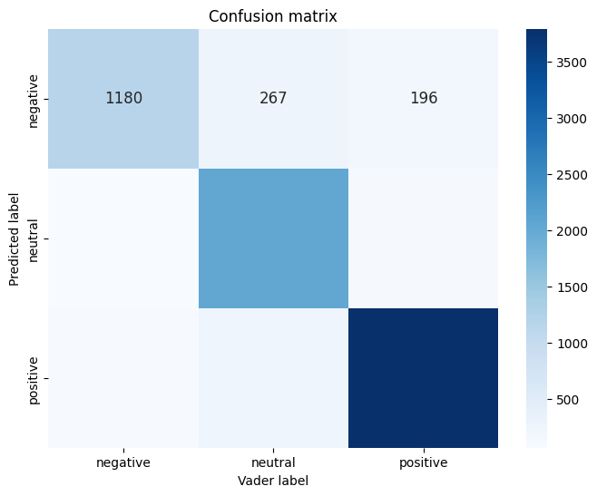

# Sentiment_analysis_Customer_Support_Tickets
Q: Sentiment Analysis on Customer Support Tickets: Develop a sentiment analysis model to classify customer support tickets as Positive, Neutral, or
Negative based on text data.
1. Dataset: https://www.kaggle.com/datasets/thoughtvector/customer-support-on-twitter
    * As the dataset is very large approx 24 lac. Only 10000 of sample rows has been used to train the model.

2. Data Preprocessing:
    * Removing the user Mention
    * Removing links URL
    * Convert Text into Lower case
    * Removing everything other than words like emojis, punctuations, special characters
    * Tokenize, lemmetize and removing Stopwords using spacy 

3. To create the prediction model we need labeled dataset. To generate the label use SentimentIntensityAnalyzer from nltk.sentiment.vader
    * This will read each row or can be say as text give the output on Neutral, Negative, Positive and Compound
    * Based on Compound score we labeled them.
    * Classify sentiment based on scores: 
        if compound score is greater than 0.05 then it is positive
        compound score is greater than -0.05 and less then 0.05 then it is neutral
        and if it is less than -0.05 Then it is negative
    * Based on sample dataset labeled data is as below:  
        positive : 5189
        neutral  : 2808
        negative : 2003
    * Label Encode the data using LabelEncoder to train the model

4. TF-IDF is used for convert text data into matrix

5. Training the Models:
    * Logistic Regression:
        Accuracy score with Train data is: 87.66%
        Confusion Matrix
        
        neg [[1180  267  196]
        Neu [  68 2041  119]
        Pos [  86  251 3792]]
              neg  neu pos   
            
        * Random Forest Classifier:
        Accuracy score with Train data is: 99.17%
        Confusion Matrix
        
        neg [[1613  28  2]
        Neu  [  1 2224  3]
        Pos  [  0  32 4097]]
              neg  neu pos   

6. Model dump and loaded to make prediction.
    * From prediction we need to preprocess the data like removing URLs, Mentions, stopwords, emojis and converting lower case
    * Transform into word vectorizer
    * Pass it to model to make prediction
        Values and their Corresponding labels are as given below:
        0: Negative
        1: Neutral
        2: Positive
        
7. Streamlit App Link: https://sentimentanalysiscustomersupporttickets-thriftyai.streamlit.app/
   Note: app is not working. There is an error related to requirement.txt or installing dependencies.

